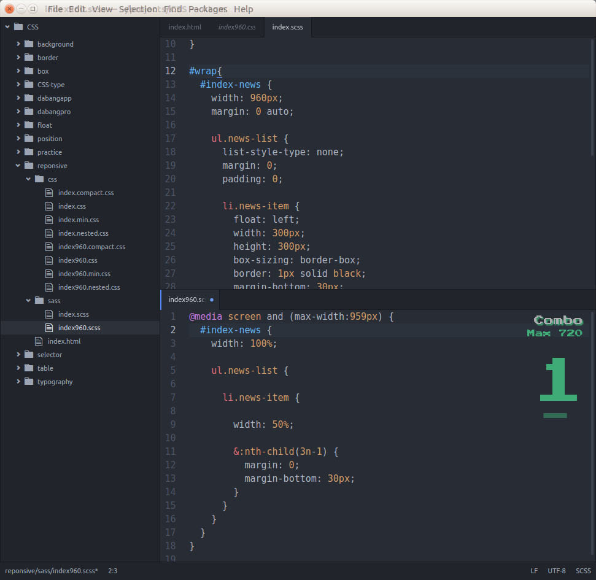

# Responsive Web

하나의 HTML파일에 적용되는 CSS속성만 바꾸어, 여러 너비의 디바이스에서 적절히 레이아웃의 모양을 변경하는 기술

-


### 뷰포트(viewport)

스마트폰에서 내용이 표시되는 영역  
모바일 브라우저의 기본 `viewport width`는 980px로, 가로크기가 제각각인 모바일 기기의 특성상 뷰포트 값을 지정해야 함


#### 뷰포트 태그

`<meta>`태그를 사용하며, `<head>`와 `</head>`사이에 기록

> ex) `<meta name='viewport' content='width=device-width, initial-scale=1'>`


일반적으로 모바일 기기의 가로너비를 전체 표시되는 영역으로 설정하며, 그 경우 `content`에  
`width=device-width`를 지정


#### 뷰포트 태그의 content에 설정 가능한 속성/값
속성 | 설명 | 값 | 기본값
---|---|---|---|
width|뷰포트 너비|device-width 또는 크기값|브라우저 기본 값(대부분 980px)
height|뷰포트 높이|device-height 또는 크기|브라우저 기본 값
user-scalable|확대/축소 가능여부|yes/no|yes
initial-scale|초기 확대/축소 값|1~10|1
minimum-scale|최소 확대/축소 값|0~10|0.25
maximum-scale|최대 확대/축소 값|0~10|1.6

<br>

### 미디어쿼리 (media queries)

접속한 장치에 따라 특정 CSS스타일을 사용할 수 있도록 해주는 CSS모듈

#### 미디어쿼리 구문

**기본문법**  
`@media [only | not] 미디어유형 [and 조건(복수)]`

**일반적으로 많이 사용하는 구문**  

- `@media screen (min-width: 1024px)` : 최소크기가 1024px 이상일 때 (PC)
- `@media screen (max-width: 1023px)` : 너비가 1023px 이하일 때 (태블릿)
- `@media screen (max-width: 768px)` : 너비가 768px 이하일 때 (모바일)
- `@media screen (max-width: 320px)` : 너비가 320px 이하일 때 (모바일, 아이폰5이하)


#### 수업 내용 중 기억할 것


**선택자 명시도 주의!!!!
명시도 높은 구문이 우선순위**

index.scss 에서는 
```Sass
#wrap {
	#index-news {
	}
}
```
로 명시도가 더 높은데 index960.scss는
```Sass
#index-news {
}
```
로 명시도가 더 낮아져서 `#wrap >` 을 붙여주지 않으면 무시된다. 그래서 미디어 쿼리가 작동하지 않는다. **(주의)**

**아래쪽에 있는 구문이 더 우선순위가 높다. 미디어 커리도 이것을 이용하여 해상도 별로 분기를 설정하여 코드를 덮어쓰는(?) 형식.**

**아이폰에서 414px을 분기로 주로 사용함**

**미디어 쿼리로 CSS 스타일 작성시 `vh`나 `%` 주로 사용함. `flex`를 사용하면 편리하지만 국내에는 지원하지 않는 브라우저가 많다. **
