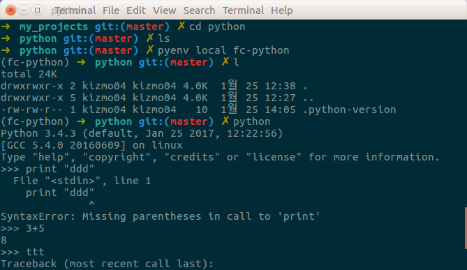

# pyenv, virtualenv, iPython설치 및 설정


## pyenv

pyenv는 프로젝트별로 파이썬 버전을 따로 관리할 수 있도록 도와주는 라이브러리입니다.  
여러 프로젝트를 동시에 진행하다보면, 어떤 프로젝트에서는 2.7을, 어떤 프로젝트에서는 3.4를 사용하는 식으로 다양한 버전의 사용할 수도 있고, 각각에 설치된 라이브러리간 충돌이 일어날 수도 있습니다.

## virtualenv

virtualenv는 파이썬 개발환경을 프로젝트별로 분리해서 관리할 수 있게 해주는 라이브러리입니다.  
위의 pyenv와 다른점은, pyenv는 **파이썬**의 버전을 관리해주는 것이며, virtualenv는 **파이썬 패키지 설치 환경**을 따로 관리해줍니다.

## pyenv-virtualenv

위의 pyenv제작자가, pyenv를 사용할 경우 쉽게 virtualenv를 사용할 수 있도록 만든 라이브러리입니다.


## pyenv 설치

* 맥  
`brew install pyenv`  
`brew install pyenv-virtualenv`

* 리눅스  
<https://github.com/yyuu/pyenv-installer>  
`curl -L https://raw.githubusercontent.com/yyuu/pyenv-installer/master/bin/pyenv-installer | bash`

## vim설치 (리눅스만)

```
sudo apt-get install vim
```

## 기본 셸 변경

### zsh

<http://theyearlyprophet.com/love-your-terminal.html>  
bash와 비슷하게 동작하는 셸로, 사용성이 좋습니다.

#### 리눅스

```
sudo apt-get install zsh
curl -L http://install.ohmyz.sh | sh
chsh -s `which zsh`
```

#### 맥

```
brew install zsh zsh-completions
curl -L http://install.ohmyz.sh | sh
```

> **확인법**  
> echo $SHELL


## pyenv 설정

* 설치 후 pyenv관련 설정을 shell설정에 추가  
	* 맥 `vi ~/.zshrc`
	* 리눅스 	`vim ~/.zshrc`


> 맥
> 
```
export PYENV_ROOT=/usr/local/var/pyenv
if which pyenv > /dev/null; then eval "$(pyenv init -)"; fi
if which pyenv-virtualenv-init > /dev/null; then eval "$(pyenv virtualenv-init -)"; fi
```

> 리눅스
> 
```
export PATH="~/.pyenv/bin:$PATH"
eval "$(pyenv init -)"
eval "$(pyenv virtualenv-init -)"
```

pyenv 기본 루트폴더는 `~/.pyenv`  
!!pyenv설정을 shell의 설정파일에 기록 후, 터미널을 재시작하거나 `source ~/.zshrc` 또는 `source ~/.zsh_profile`을 실행

-

#### 파이썬 설치 전 필요 패키지 설치

<https://github.com/yyuu/pyenv/wiki/Common-build-problems>


#### 파이썬 셸 관련 설정 (macOS)

> 셸에서 방향키 관련 이슈 해결을 위한 유틸리티 설치

관련 유틸리티 설치 (readline, xz)

```
brew install readline xz
```

-

#### pyenv를 사용해서 파이썬 3.4.3버전 설치  

`pyenv install 3.4.3`

#### 가상환경 생성

`pyenv virtualenv <version> <env name>`
> `pyenv virtualenv 3.4.3 fc-python` 입력

#### 사용할 폴더로 이동
```
cd projects
mkdir python
cd python
```

#### local에 가상환경 지정


`pyenv local fc-python`

- `pyenv versions` 로 확인해보면 만들어둔 파이썬 가상환경을 확인할 수 이 ㅆ따. 

`pyenv global 3.4.3` 으로 버전을 지정해주면 자동으로 python 3.4.3 버전을 사용하게 한다. 
`pyenv versions` 와 `python --version`으로 확인해보면 지정해준 버전이 나온다. 
`python local fc-python` 으로 아까만들어준 가상환경을 로컬로 지정해줌.

`l` 하면 `.python-version`이라는 숨김파일이 보임
`python`으로 파이선셸로 들어가서 바로 파이썬 스크립트 실행할 수 있다. 


* pip : 파이썬 패키지 관리자

pip list 했을때 현재 가상환경에서는 두가지만 나타나야함. pip 랑 setuptools 
## iPython

기본 파이썬 셸보다 다양한 기능을 사용할 수 있도록 해주는 셸을 제공해줌

## iPython 설치

`pip install ipython`

커맨드라인에서 `ipython`실행

-

#### vi 단축키

`shift + g` : 가장 아래로  
`shift + a` : 현재 줄에서 가장 마지막으로